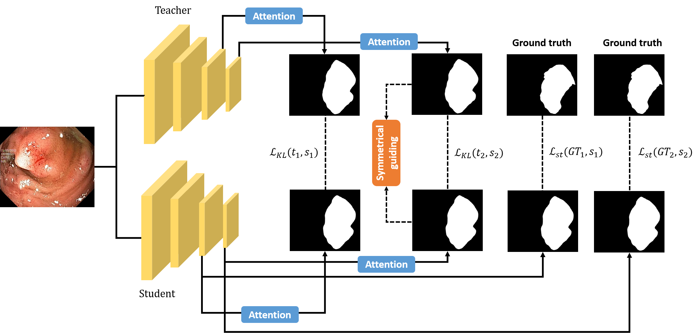
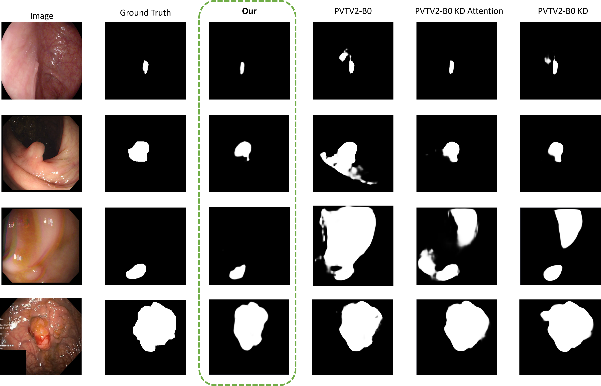

# KDAS3
This is an official implementation of KDAS3, Knowledge distillation via Attention Supervision, and Symmetrical structure guiding for Polyp Segmentation.

Author: Quoc-Huy Trinh , Trong-Hieu Nguyen Mau , Phuoc-Thao Vo Thi , Minh-Triet Tran , Hai-Dang Nguyen

<div align="center">
    <a href="./">
        
    </a>
</div>


## Installation

To install all of the packages for training, please install via the ```requirements.txt``` file. Please follow this command to install:

```
pip install -r requirements.txt
```

## Dataset

For the dataset, we use the dataset follow the setting of [PraNet](https://github.com/DengPingFan/PraNet), we also provided the data in this [Drive](https://drive.google.com/drive/folders/10SYLHNvO0fSrhhVhj5U-cFgOnTH5uGJf?usp=sharing) link to download the data via google drive.

After downloading this dataset, you can unzip the training data and testing data, then put them into the ```./data/``` folder for the training data.

## Training

For training, you run ```train_kd_paper.py``` file via command:

```
python train_kd_paper.py
```

Or you can run the script that we prepared via bash script file ```train.sh``` via:

```
bash train.sh
```

After running the training script, the training process will start. We also tried experiments on RTX5000, and it works well, so notice the batch size to reduce the OOM problem.

The teacher weight can be found at [Polyp-PVT](https://github.com/DengPingFan/Polyp-PVT), we train our student model on the PVTV2-B0 backbone with the architecture from Polyp-PVT teacher, please put teacher weight in ```./teacher_weights/``` folder.

## Testing

For produce the testing segmented mask, use ```test_paper.py``` file via this command:

```
python test_paper.py
```

From this one, you can run the segmentation on the test dataset, and it will save the result in the folder ```/result_map/PolypPVT_vis```.

To evaluate the result, please follow this instruction from [UACANet](https://github.com/plemeri/UACANet), however, we also prepare the evaluation script via ```eval.py``` file. You can run the evaluation via the configuration in ```./configs/eval.yaml```. The following command will run the evaluation.

```
python run/Eval.py --config configs/eval.yaml --verbose
```

After you run the testing file, the ground truth path and the mask segmented can be defined in the configuration file. This benchmark follow the benchmark setup from [PraNet](https://github.com/DengPingFan/PraNet), which is used in the Polyp Segmentation task.

## Result

The following is the mask results from the distilled model of our training and testing:

<div align="center">
    <a href="./">
        
    </a>
</div>

## Acknowledgement
Thank you so much for following setup to help me finish this research.

1. [Polyp-PVT](https://github.com/DengPingFan/Polyp-PVT)

2. [PraNet](https://github.com/DengPingFan/PraNet)

3. [UACANet](https://github.com/plemeri/UACANet)

## Citation
Coming soon
